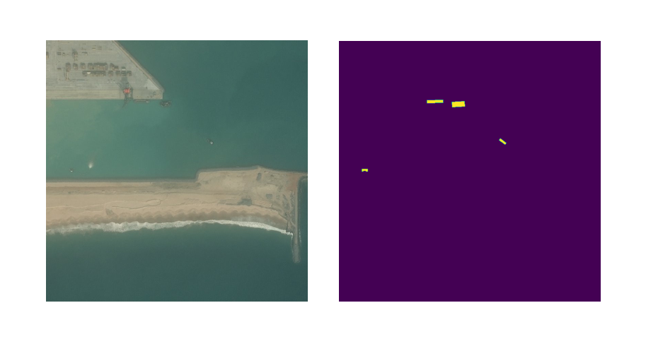

## Airbus Ship Detection

This project contains code to preprocess dataset, train and inference 
model for [airbus ship detection task](https://www.kaggle.com/c/airbus-ship-detection/overview).

## Dataset preprocess

As dataset for the task consist of csv with imageIds and encoded pixels, firstly data was reviewed and cleaned, 
so the size of the dataset actually available for training can be calculated and images can be reviewed. 
Data exploration is done in  DataExplore.ipynb file.

To train the model for object segmentation was decided to create binary masks from the values of encoded pixels. 
To do that for each image which contained segments, thus had encoded pixel string in csv file with data for training, 
where done several steps:
1. Calculate actual pixel values from encoded pixels
2. Create 1d zeros array with size width*height of actual image
3. Assign values on the actual pixel positions value 255
4. Reshape 1d array to 2d array with width and height as the actual image

<figure>
  
  <figcaption style="text-align: center">Image and mask example</figcaption>
</figure>

To create datasets, list of image ids was split by rates, and then for training, validation and testing according to 
the corresponding image ids masks were created and labeled, alldata was reshaped and then stored as numpy arrays.    
As default training split rate is set to 0.6, and validation and testing rates are calculated as (1-train_rate)/2.

## Training

Model: simple U-Net architecture with 4 downsample and upsample blocks. Simply it can be made more 
deep and complex if needed, also Dropout layers can be added.    
Metrics: dice coefficient, Jaccard index, accuracy    
Callbacks: ModelCheckpoint, CSVLogger 

Overall training algorythm steps are:
1. Create datasets for training, validation and testing 
2. Build and compile the model
3. Train and validate (if validation dataset is not empty) model with chosen learning rate, batch size and number 
of epochs
4. Evaluate model performance (if test dataset is not empty)

#### Run train
```bash
python train.py --dataset_path path/to/dataset --LR learning_rate --loss loss --epochs num_of_epochs --batch_size batch_size
```

## Inference

Inference on the image and dataset is available. As a result at the same path as the project result.csv file with 
imageIds and encoded pixels will be created.

#### Run inference on image or dataset
```bash
python inference.py --inf_path path/to/image_or_dataset
```
Optionally such flags can be added:    
`--model_path`: custom path to load model from.    
`--csv_path`: custom path to save result csv to.    
`--save_masks`: flag to enable saving prediction masks as images.    
